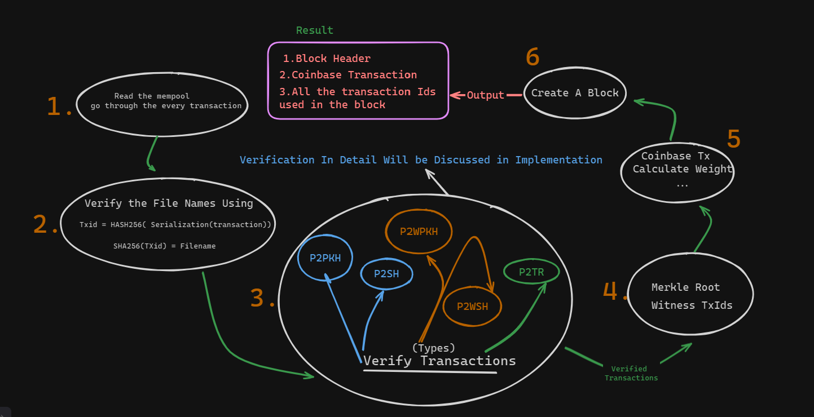

# Solution to the SOB(Summer of Bitcoin) Assingment

## Design Approach:


## Design Overview

1. **Read Mempool Transactions**: Read all transactions from the memory pool (mempool).
2. **Verify File Names**: For each transaction, verify the file names by first calculating the `txId` as `Hash256(serialization(transaction))`, then compute `SHA256(txId)` to get the filename.
3. **Transaction Verification**: Verify all transactions using the `script_signature_asm` and `scriptpubkey_asm`, implementing a stack. Further details on this step will be discussed in the implementation section.
4. **Transaction Types**: Various types of transactions exist as depicted in the design. These types will be handled during the verification process.
5. **Create Merkle Root and Witness Txids**: Take the verified transactions and create a merkle root and witness Txids, along with the transactionIds needed to be added to the block.
6. **Create Coinbase Transaction**: As there are segwit transactions, create a coinbase transaction using the witness Txids produced in the previous step. Calculate the transaction weight and fees for verification.
  7. **Create Block**: Use the merkle root , and vary nonce and time stamps to meet the dificulty target and create the block

## Implementation Details

### Structure of MyCode

```

code-challenge-2024-narasimha-1511/

├── solution/
│   ├── index.js
│   ├── mine.js
│   └── Helpers/
│       ├── ecdsa.js  
│       ├── Hashes.js  
│       ├── ImplementCommands.js  
│       │── witnessTxId.js  
│       ├── digests/
│       │   ├── messageDigest.js
│       │   ├── messageDigest_p2sh.js
│       │   ├── messageDigestp2wpkh.js
│       │   └── serializeTxn.js
│       └── block/
│           ├── calculateWeight.js
│           ├── coinBase.js
│           ├── createBlock.js
│           ├── merkle_root.js
├── SOLUTION.md
└── README.md
```

The directory structure described above will now be discussed in terms of its implementation details

  ### Table Of Functions
  - [Verifying Transactions](#index.js)
  - [ECDSA Verification](#Helpers/ecdsa.js)
  - [Hashes](#Helpers/hashes.js)
  - [Implementing Stacks](#Helpers/ImplementCommands.js)
  - [Serialization](#Helpers/digests/serialize.js)
  - [Message Digest for P2PKH](#Helpers/digests/messageDigest.js)
  - [Message Digest for P2SH](#Helpers/digests/messageDigest_p2sh.js)
  - [Message Digest for P2WPKH, P2SH-P2WPKH, P2WSH](#Helpers/digests/messageDigest_p2wpkh.js)
  - [Merkle Root](#Helpers/Block/merkleRoot.js)
  - [Witness Transaction ID](#Helpers/witnessTxID.js)
  - [Coinbase Transaction](#Helpers/Block/Coinbase.js)
  - [Calculate Weight](#Helpers/Block/calculateWeight.js)
  - [Create Block Header](#Helpers/Block/createBlock.js)
  - [Mining](#mine.js)
  

###   `index.js` 

```javascript

    fn readAllFiles(dir="mempool") ->
    {
        ValidTxns = []
        for(transaction in mempool){
            if(isValidFileName(transaction)){
               ValidTxns.push(transaction)
            }
        }  
        TxnsforMining = [];
        
        validTxns.forEach((txn)=>{
            if(verify(txn)){
                TxnsforMining.push(txn)
            }
        });
        
        mine(TxnsforMining);
        
        fn veriy(transaction){
            /*
            here every transaction will be
            verfied using the script pub key asm's and witnesses
            we run these asm's in stacks,
            each opcode has a particluar funciton
            */
           ImplementCommands(transaction.asms);
           msgDigest = digest(transaction);
           signature = transaction.signature;
           publicKey = transaction.pubKey;
           return verifyECDS(msgDigest,signature,publicKey);
        }
    }

    function isValidFileName(JsonData, fileName) {
        serialize = serialize(Jsondata)
        txid = HASH256(serialize)// assumin this is in little endian format
        file = SHA256(txid)
        if(file == fileName) true;
    }

```

**Explanation**
1. Above, you can see that we first go through all the transactions and only select those whose filename is valid for filtering these transactions.
2. Then, we start validating these transactions using the script pubkey ASM's, and we mostly verify their ECDSA signatures here.
3. All the external functions used, such as ECDSAVerification,ImplementCommands will be discussed in the next files.
4. All the script signature asms , will be implemented using the ImplementCommands function will be discussed later
</details>

### `Helpers/ecdsa.js`

```javascript
    const pkg = require('elliptic')
    const { ec:EC } = pkg;

    fn ECDSAverify(message,pubkey,signature){
        const ecdsa = new EC("secp256k1");
        const key = ecdsa.keyFromPublic(pubkey, "hex");
        const isValid = key.verify(message, parseDER(signature));
    return isValid;
    }

    fn parseDER(signature){
        const rl = parseInt(serialized.substring(6, 8), 16) * 2;
        const r = serialized.substring(8, 8 + rl);
  
        const sl = parseInt(serialized.substring(10 + rl, 12 + rl), 16) * 2;
        const s = serialized.substring(12 + rl, 12 + rl + sl);

        return { r, s };
    }
```
**Explanation**

1. Here, above, you can see that first, after we start the function, we use the elliptic library for verifying without reinventing the wheel.
2. We pass the public key and message as they are.
3. As the signature is DER encoded, we extract the r and s values and pass them as an object in this function.
4. 
reference for Parsing the Signature : https://learn.saylor.org/mod/book/view.php?id=36341&chapterid=18917

### `Helpers/hashes.js`
  
```javascript
fn doubleSha256(hexInput):
    buffer = Convert hexInput to Buffer
    firstHash = Calculate SHA-256 hash of buffer
    secondHash = Calculate SHA-256 hash of firstHash
    RETURN secondHash as hexadecimal string

fn SHA256(data):
    buffr = Convert data to Buffer
    sha256 = Create new SHA-256 hash object
    RETURN SHA-256 hash of buffer as hexadecimal string

fn OP_HASH160(publicKey):
    sha256Hash = Create new SHA-256 hash object
    sha256Hash.update(Convert publicKey to Buffer)
    sha256 = Get digest of sha256Hash
    ripemd160Hash = Create new RIPEMD-160 hash object
    ripemd160Hash.update(sha256)
    ripemd160 = Get digest of ripemd160Hash
    RETURN ripemd160 as hexadecimal string
```

**Explanation**
- **doubleSha256** Calculates the double SHA-256 hash of a given hexadecimal input (hexInput). calculates the first SHA-256 hash , and again using SHA-256 and returns the final hash result as a hexadecimal string.
- **SHA256**  Calculates the SHA-256 hash of a given data string (data). SHA-256 hash using Node.js's crypto module. Returns the resulting hash.
- **OP_HASH160**  Implements the OP_HASH160 operation commonly used in Bitcoin scripts. Calculates the SHA-256 hash of the publicKey input, then calculates the RIPEMD-160 hash of the SHA-256 hash. Returns the final RIPEMD-160 hash .
**Note**: All these functions first Convert the given Hex to Buffer then Again while returning the hash they convert to hex
### `Helpers/ImplementCommands.js`

```javascript
fn ImpelmentCommands(stack, commands, type, transaction, index):
    commands.forEach((command)=>{
       IF command STARTS WITH "OP_PUSHBYTES_" OR "OP_PUSHDATA1" OR "OP_0":
            CONTINUE // These commands are automatically handled when the bytes are pushed
        ELSE IF command EQUALS "OP_HASH160":
            stackElement = stack.pop()
            hash = OP_HASH160(stackElement)
            stack.push(hash)
        ELSE IF command EQUALS "OP_EQUAL" OR command EQUALS "OP_EQUALVERIFY":
            stackElement1 = stack.pop()
            stackElement2 = stack.pop()
            stack.push(stackElement1 EQUALS stackElement2)
        ELSE IF command EQUALS "OP_DUP":
            stackElement = stack.pop()
            stack.push(stackElement)
            stack.push(stackElement)
           // ... more Commands are there for op codes
    })
    RETURN stackk
```

**Explanation**
 - The `ImpelmentCommands` function takes several arguments: a stack to hold values, commands representing the script commands to be executed, `type` indicating the transaction type, transaction representing the transaction data, and `index` indicating the index of the transaction input. The function iterates over each command in the commands array and implements the logic based on the command type.
- For commands like `OP_PUSHBYTES_`, `OP_PUSHDATA1`, and `OP_0`, no action is taken as the bytes are automatically pushed onto the stack.
- Commands like `OP_HASH160` calculate the `RIPEMD-160` hash of the top stack element and push the result back onto the stack.
- Commands like `OP_EQUAL` and `OP_EQUALVERIFY` compare the top two stack elements for equality and push the result back onto the stack.
- We have many `OP_CODES` as we go on, so here is the reference to the opcodes: [Script - Bitcoin Wiki](https://en.bitcoin.it/wiki/Script)

### `Helpers/digests/serialize.js`

```javascript
fn serializeTxn(transaction):
    serialized = ""
    serialized += version
    serialized += input_count
    // Serialize inputs
    FOREACH input IN transaction.vin:
        serialized += input.txid
        serialized += input.vout
        // Serialize scriptSig length
        serialized += input.scriptsig.length // in bytes 
        serialized += input.scriptsig
        serialized += input.sequence 
        
    serialized += transaction.vout.length // outputcount

    // Serialize outputs
    FOREACH output IN transaction.vout:
        serialized += output.value
        serialized += output.scriptpubkey.length // in bytes
        serialized += output.scriptpubkey
    
    serialized += transaction.locktime
    RETURN { filename: serialized, types: set }
```
  **Explanation**:
- The `serializeTxn` function serializes a Bitcoin transaction object into a hexadecimal string representation.
- It iterates over the transaction's inputs and outputs, appending their serialized representations to the `serialized` string.
- For each input, it appends the transaction ID (`txid`) in little-endian format, the output index (`vout`) in little-endian format, the scriptSig length, the scriptSig itself (if the inputIndex matches or if inputIndex is -1), and the sequence in little-endian format.
- For each output, it appends the value in little-endian format (assuming it's in satoshis), the scriptPubKey length, and the scriptPubKey itself.
- The function returns an object containing the serialized transaction string (`filename`) and a set (`types`) of unique scriptpubkey types encountered in the inputs.
### `Helpers/digests/messageDigest.js`

**This Digest is particularly for only Transaction of type p2pkh**

```javascript
fn messageDigest(transaction, inputIndex):
    serialized = ""
    serialized += transaction.version
    serialized += transaction.vin.length//input_count

    FOREACH input IN transaction.vin:
        serialized += input.txid
        serialized += input.vout

        IF index EQUALS inputIndex:
            serialized += input.prevout.scriptpubkey.length 
            serialized += input.prevout.scriptpubkey
        ELSE:
            serialized += "00" // Empty scriptSig
        
        serialized += input.sequence
    
    serialized += transaction.vout.length//output_count

    FOREACH output IN transaction.vout:
        serialized += output.value
        serialized += output.scriptpubkey.length 
        serialized += output.scriptpubkey

    serialized += transaction.locktime
    
    RETURN serialized + "01000000"// this is SIGH_HASH_ALL 
```

**Explanation**
- The `messageDigest` function serializes a Bitcoin transaction object into a hexadecimal string representation, similar to the `serializeTxn` function.
- It iterates over the transaction's inputs and outputs, appending their serialized representations to the `serialized` string.
- For each input, it appends the transaction ID (`txid`) in little-endian format, the output index (`vout`) in little-endian format, the scriptSig length, the scriptSig itself (if the inputIndex), and the sequence in little-endian format.
- For each output, it appends the value in little-endian format (assuming it's in satoshis), the scriptPubKey length, and the scriptPubKey itself.
- The function returns the serialized transaction string (`serialized`) appended with a standard four-byte little-endian value ("01000000") representing the transaction's default locktime.
- I have not converted anything to little endian as this is a pseudo code
### `Helpers/digests/messageDigest_p2sh.js`

```javascript
fn messageDigest_p2sh(transaction, inputIndex):
    messageDigest_p2sh = ""

    messageDigest_p2sh += transaction.version
    messageDigest_p2sh += transaction.vin.length

    // Serialize inputs
    FOREACH input, index IN transaction.vin:
        messageDigest_p2sh += input.txid
        messageDigest_p2sh += input.vout
        IF index EQUALS inputIndex:
            // Serialize scriptSig
            let scriptsig_asm = input.scriptsig_asm || "SCRIPT SIG ASM: MISSING";
            let scriptsig_asm_slices = scriptsig_asm.split(" ");
            let redeem_script = "";
            IF scriptsig_asm_slices.length != 0:
                redeem_script = scriptsig_asm_slices[scriptsig_asm_slices.length - 1];
            messageDigest_p2sh += redeem_script.length 
            messageDigest_p2sh += redeem_script;
        ELSE:
            messageDigest_p2sh += "00"; // Empty scriptSig
            
        messageDigest_p2sh += input.sequence
        
    messageDigest_p2sh += transaction.vout.length

    // Serialize outputs
    FOREACH output IN transaction.vout:
        messageDigest_p2sh += output.value
        messageDigest_p2sh += output.scriptpubkey.length 
        messageDigest_p2sh += output.scriptpubkey
    
    messageDigest_p2sh += transaction.locktime

    RETURN messageDigest_p2sh + "01000000"; // This is the SIGHASH_ALL flag

```

**Explanation**
- The `messageDigest_p2sh` function is used to create a message digest for a P2SH (Pay-to-Script-Hash) transaction.
- It serializes the version, inputs, and outputs of the transaction, similar to the `messageDigest` function, but also includes the redeem script for the specified `InputIndex`.
- If the `InputIndex` matches the current input being serialized, the redeem script is included in the serialized output. Otherwise, an empty scriptSig is added.
- The function returns the serialized message digest appended with the SIGHASH_ALL flag (represented as "01000000" in hexadecimal).
- I have not Converted any of them to Little endian as this is a Pseudo Code
### `Helpers/digests/messageDigest_p2wpkh.js`

**This Message Digest is  for Types , P2WPKH . P2WSH, P2SH_P2WPKH.**

```javascript
fn messageDigestp2wpkh(transaction, inputIndex, type = "p2wpkh"):
    IF transaction.vin.length <= inputIndex THEN
        RETURN ""; // Invalid input index, return empty string
    END IF

    version = transaction.version
    
    prevouts = ""
    sequences = ""
    
    FOREACH input IN transaction.vin:
        prevouts += input.txid
        prevouts += input.vout
        sequences += input.sequence
        
    hashPrevouts = doubleSha256(prevouts)
    SequenceHash = doubleSha256(sequences)

    serialized = version + hashPrevouts + SequenceHash

    serialized +=
        transaction.vin[inputIndex].txid +
        transaction.vin[inputIndex].vout
        
    IF type EQUALS "p2wpkh" THEN
        // Serialize script code for p2wpkh
        serialized +=
            "1976a914" +
            transaction.vin[inputIndex].prevout.scriptpubkey.slice(4) +
            "88ac"
    ELSE IF type EQUALS "p2sh_p2wpkh" THEN
        // Serialize script code for p2sh_p2wpkh
        serialized +=
            "1976a914" +
            transaction.vin[inputIndex].inner_redeemscript_asm.split(" ")[2] +
            "88ac"
    ELSE IF type EQUALS "p2wsh" THEN
        // Serialize witness data for p2wsh
        let length = transaction.vin[inputIndex].witness.length;
        serialized +=
            transaction.vin[inputIndex].witness[length - 1].length  +
            transaction.vin[inputIndex].witness[length - 1]
    
    serialized += transaction.vin[inputIndex].prevout.value
    serialized += transaction.vin[inputIndex].sequence
    
    outputs = ""
    FOREACH output IN transaction.vout:
        outputs += output.value
        outputs += output.scriptpubkey.length
        outputs += output.scriptpubkey

    hashOutputs = doubleSha256(outputs)
    serialized += hashOutputs

    // Serialize locktime
    serialized += transaction.locktime
    
    RETURN doubleSha256(serialized + "01000000")
```

**Explanation**
- The `messageDigestp2wpkh` function is used to create a message digest for a P2WPKH (Pay-to-Witness-Public-Key-Hash) transaction.
- It serializes the version, prevouts, sequences, current input, script code, input amount, sequence, outputs, and locktime of the transaction.
- The function handles different types of transactions based on the `type` parameter:
    - For `p2wpkh`, it includes the script code for P2WPKH.
    - For `p2sh_p2wpkh`, it includes the script code for P2SH-P2WPKH.
    - For `p2wsh`, it includes the witness data for P2WSH.
- The function then calculates the double SHA-256 hash of the serialized data appended with the SIGHASH_ALL flag (represented as "01000000" in hexadecimal) and returns the resulting hash.
- Reference : [BIP 143: Transaction Signature Verification for Version 0 Witness Program (bips.dev)](https://bips.dev/143/)
### `Helpers/Block/merkleRoot.js`
```javscript
```
### `Helpers/witnessTxID.js`
```javscript
```
### `Helpers/Block/Coinbase.js`
```javscript
```
### `Helpers/Block/calculateWeight.js`
```javscript
```
### `Helpers/Block/createBlock.js`
```javscript
```
### `mine.js`
```javscript
```


## Results and Performance:
Present the results of your solution, and analyze the efficiency of your solution.

  

## Conclusion:
Discuss any insights gained from solving the problem, and outline potential areas for future improvement or research. Include a list of references or resources consulted during the problem-solving process.